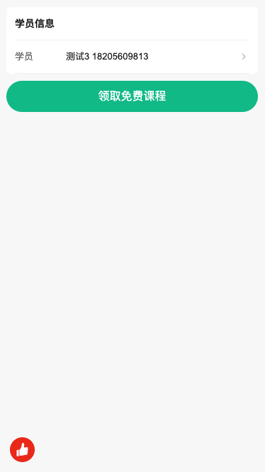

## 获取学员、上课时间、上课地址

### props

name | 类型 | 描述 | 默认值
- | - | - | -
time | Boolean | 是否需要获取时间 | false
address | Boolean | 是否需要获取地址 | false
onSubmit | Function | 确定回调 | Promise.resolve()

- 注：
onSubmit: (data: { student, time, address }) => Promise

### 图片

