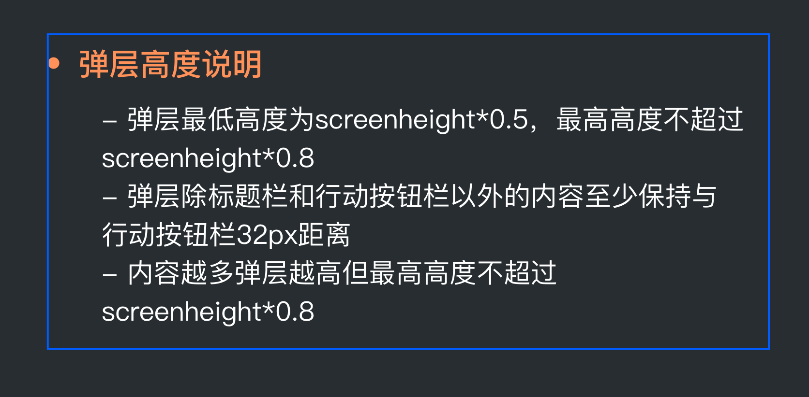
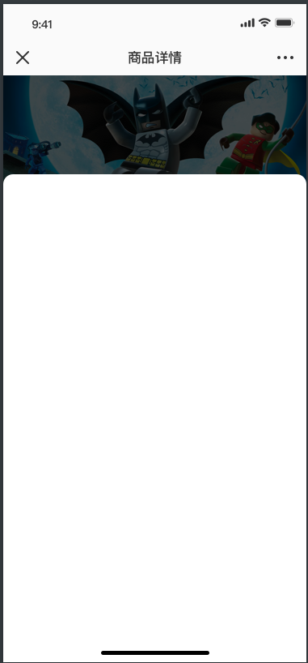

!> 即将被废弃，直接使用 vis-ui 的同名组件

### 公共弹窗

- 封装了高度规范



#### props

- 除 `position` 外，其他 vant `popup` 组件 api 都支持

name | 类型 | 是否必填 | 默认值 | 描述
- | - | - | - | -
title | String | 否 | '' | 标题
buttons | Array | 否 | [] | 底部按钮（已做iphonex适配）

例：
```
const buttons = [
  {
    text: '确定',
    class: 'main-btn',
    onClick: () => {},
  }
]
```

#### slots
name | 说明
- | -
default | 弹窗内容


